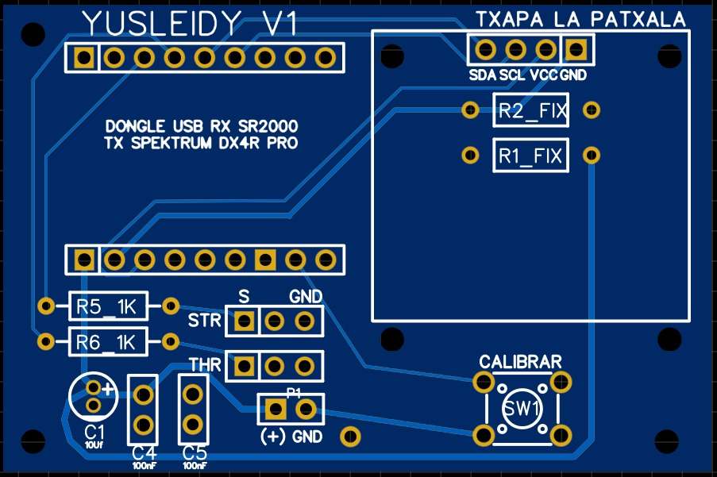
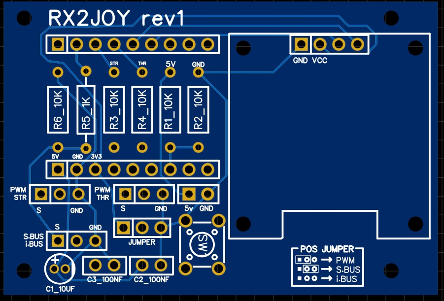

# RX2JOY — gen2

##Yusleidy Gen2 Rev1 VERSION 1 (Spektrum PWM)


##UART Gen2 RX2JOY Rev1 VERSION 2 (Multimarca PWM/S.BUS/i.BUS)


Adaptador USB multimarca para simuladores de RC de superficie.
Convierte la salida de casi cualquier receptor de superficie en un joystick USB
HID, sin drivers ni software intermedio.

```
Radio  →  Receptor  →  RX2JOY  →  USB HID  →  VRC Pro
         (PWM / S.BUS / i-BUS)
```

---

## Revisiones

| Revisión | Carpeta | Entrada | Radios | Estado |
|---|---|---|---|---|
| rev1 "Yusleidy" | [`hardware/rev1-yusleidy/`](hardware/rev1-yusleidy/) | PWM, 2 canales | Spektrum | PCB diseñada |
| rev2 "UART" | [`hardware/rev2-uart/`](hardware/rev2-uart/) | PWM + bus serial | Multimarca | En desarrollo |

La rev2 es la rev1 más cuatro componentes: un conector de bus serial (J4), un
jumper selector de protocolo (JP1) y dos resistencias (R5, R6). Todo lo demás es
idéntico, así que el firmware de la rev2 corre en la rev1 quedándose en modo PWM.

---

## Por qué funciona con cualquier marca

Cada fabricante usa su propio protocolo de radio: DSMR en Spektrum, AFHDS 3 en
FlySky, T-FHSS en Futaba, FH5 en Sanwa. Son propietarios, cerrados y, salvo los
de Spektrum, sin implementaciones abiertas maduras.

El truco es que **ese enlace queda encerrado dentro del receptor**. RX2JOY nunca
lo ve. Lo que lee es la salida del receptor, que sí está estandarizada en la
industria. Por eso cambiar de marca de radio se reduce a cambiar de receptor, y
el adaptador no necesita saber nada del protocolo de radio.

---

## Modos de entrada

| Modo | Cableado | Señal | Reposo | Canales |
|---|---|---|---|---|
| **PWM** | Un cable por canal | Pulsos 1000–2000 µs cada ~20 ms | — | 2 |
| **S.BUS** | Un solo cable | UART 100000 8E2, **invertido** | Bajo | hasta 16 |
| **i-BUS** | Un solo cable | UART 115200 8N1 | Alto | hasta 14 |

### Selección de modo

Un jumper en JP1, sin reflashear ni recompilar:

| Posición del jumper | Modo |
|---|---|
| Pines 1–2 (hacia 3V3) | PWM |
| Pines 2–3 (hacia GND) | S.BUS |
| Sin jumper | i-BUS |

El firmware distingue los tres estados leyendo GP14 dos veces, una con pull-up
interno y otra con pull-down. Si ambas lecturas coinciden, el pin está atado a un
riel; si difieren, está flotando.

### Sobre S.BUS invertido

S.BUS es UART invertido, lo que normalmente exige un transistor inversor. En el
RP2040 no hace falta: se invierte en el propio pin con `gpio_set_inover()`. Un
componente menos en la placa.

---

## Pinout

| GPIO | Función | Va a |
|---|---|---|
| GP1 | Bus serial (UART0 RX) | J4 vía R5 |
| GP2 | PWM dirección | J1 vía R3 |
| GP3 | PWM acelerador | J2 vía R4 |
| GP4 | I2C0 SDA | OLED |
| GP5 | I2C0 SCL | OLED |
| GP14 | Selector de protocolo | JP1 |
| GP15 | Botón CAL | SW1 |
| GP26 | ADC sensado de riel | Divisor R1/R2 |

---

## Conectores

| Ref | Función | Pines |
|---|---|---|
| J1 | PWM dirección | SIG / NC / GND |
| J2 | PWM acelerador | SIG / NC / GND |
| J4 | Bus serial S.BUS / i-BUS | SIG / NC / GND |
| P1 | Alimentación del receptor | 5V / GND |
| J3 | OLED SSD1306 | GND / VCC / SCL / SDA |

**Importante:** el pin central de J1, J2 y J4 **no está conectado**. El receptor
se alimenta desde P1, con un cable aparte. Esto se hizo para poder alimentar el
receptor desde una fuente distinta si hiciera falta, y para que la placa no
imponga una tensión a un receptor que quizá no la tolere.

---

## Resistencias y por qué esos valores

| Ref | Valor | Función |
|---|---|---|
| R3, R4 | 10 kΩ | Limitan corriente hacia los diodos de protección del GPIO si el receptor entrega 5V |
| R5 | **1 kΩ** | Igual función, pero baja a propósito |
| R6 | 10 kΩ | Pull-down del bus serial |
| R1, R2 | 10 kΩ | Divisor para sensar la tensión de riel por ADC |

R5 no puede ser de 10 kΩ porque forma un **divisor de tensión** con R6. Con
10k/10k, un nivel alto de 3.3 V llegaría al GPIO como 1.65 V, por debajo del
umbral de entrada, y el bus no se leería. Con 1 kΩ quedan 3.0 V, holgadamente
válidos.

R6 cumple además una función útil: define el estado de la línea cuando no hay
receptor conectado, de modo que el firmware puede distinguir "sin receptor" de
"receptor presente pero sin datos".

---

## Calibración

Cada marca escala distinto. Los valores de fábrica difieren incluso dentro de una
misma marca según el modo (Futaba normal contra SR/UR, Sanwa normal contra
SSR/SUR), así que el firmware **no asume rangos fijos**.

Valores de partida, solo como semilla:

| Modo | Mínimo | Centro | Máximo |
|---|---|---|---|
| PWM | 1000 µs | 1500 µs | 2000 µs |
| S.BUS | 172 | 992 | 1811 |
| i-BUS | 1000 | 1500 | 2000 |

Procedimiento con el botón CAL: se mantiene presionado, se mueven ambos controles
a sus extremos, se sueltan al centro y se libera el botón. El firmware guarda
mínimo, centro y máximo reales de cada canal.

El escalado al rango HID se hace **por tramos** respecto al centro calibrado, no
por interpolación lineal única. La razón: el centro casi nunca queda justo a
mitad de camino, por el trim de la radio, y una interpolación única dejaría el
punto muerto corrido hacia un lado.

---

## Salida USB

| Parámetro | Valor |
|---|---|
| Clase | HID Joystick |
| Ejes | 2, de 16 bits (0–32767) |
| Botones | 4, reservados |
| Polling | 1 ms (1000 Hz) |
| VID / PID | 0x1209 / 0x0001 (pid.codes) |
| Serie | Derivado del ID único del RP2040 |

El polling se deja en el mínimo aunque el receptor entregue datos cada 14 o 20 ms:
así el PC recoge cada trama apenas llega, en vez de esperar al siguiente ciclo de
sondeo. Esa espera sería latencia gratuita.

El número de serie derivado del chip permite distinguir dos adaptadores
conectados al mismo PC aunque compartan VID/PID.

---

## Montaje

1. Soldar primero los componentes bajos: resistencias y condensadores.
2. Headers hembra para la RP2040-Zero, para poder reemplazarla sin desoldar.
3. Conectores de servo alineados en el borde, respetando el orden serigrafiado.
4. JP1 accesible desde fuera de la carcasa: se cambia cada vez que se prueba un
   receptor distinto.
5. Verificar con multímetro que el pin central de J1, J2 y J4 no tenga
   continuidad con ningún riel antes de conectar un receptor.

**Antes de conectar un receptor nuevo**, medir la amplitud de su señal de salida.
El RP2040 no tolera 5 V en sus GPIO. La mayoría de los receptores entrega 3.3 V,
pero no todos, y las resistencias en serie protegen pero no eliminan el riesgo.

---

## Firmware

```
firmware/
├── CMakeLists.txt
└── src/
    ├── main.c              Bucle principal y despacho por modo
    ├── rx2joy_hid.h        Descriptor HID, VID/PID, escalado
    ├── usb_descriptors.c   Descriptores TinyUSB
    ├── tusb_config.h       Configuración de TinyUSB
    ├── pwm_capture.pio     Captura de PWM por PIO (heredado de gen1)
    ├── sbus.c / .h         Parser S.BUS
    ├── ibus.c / .h         Parser i-BUS
    ├── calib.c / .h        Calibración y persistencia en flash
    ├── display.c / .h      OLED
    ├── ssd1306.c / .h      Driver del OLED
    └── shared_state.c / .h Estado compartido entre núcleos
```

Requisitos: Pico SDK con TinyUSB. Enlazar `pico_unique_id` además de
`tinyusb_device`.

Una restricción que condiciona todo el diseño: **`tud_task()` no puede
bloquearse**. Por eso la lectura de PWM se hace por PIO y la del bus serial por
interrupción de UART, nunca esperando dentro del bucle principal.

---

## Compatibilidad de receptores

| Marca | Receptor | Modo | Estado |
|---|---|---|---|
| Spektrum | SR2000 | PWM | Probado |
| FlySky | serie FGr4 | i-BUS | Por probar |
| Futaba | con puerto S.BUS | S.BUS | Por probar |
| Sanwa | con puerto SSR | PWM | Por probar |

Notas por marca:

- **Futaba y Sanwa**: los modos de alta velocidad (SR/UR, SSR/SUR) usan pulsos
  más frecuentes y en algunos casos más angostos. Si aparecen lecturas erráticas,
  dejar el canal en modo Normal; los pocos milisegundos extra no se notan en
  simulador.
- **El puerto S.BUS no siempre viene activado de fábrica.** En varios receptores
  de superficie hay que habilitarlo desde la radio, y a veces comparte pin con un
  canal PWM. Conviene revisar el manual del receptor.
- **Failsafe**: si está configurado como "mantener posición", los pulsos nunca
  desaparecen y el adaptador no puede detectar que la radio se apagó. Con S.BUS
  esto se resuelve con el bit de failsafe de la trama; con PWM depende de
  configurar el receptor para que corte los pulsos.

---

## Estado

- [x] Esquemático rev2 verificado
- [x] Layout rev2
- [x] Descriptores USB
- [ ] Parser S.BUS
- [ ] Parser i-BUS
- [ ] Selector de modo en firmware
- [ ] PCB rev2 fabricada
- [ ] Pruebas con receptores de otras marcas
